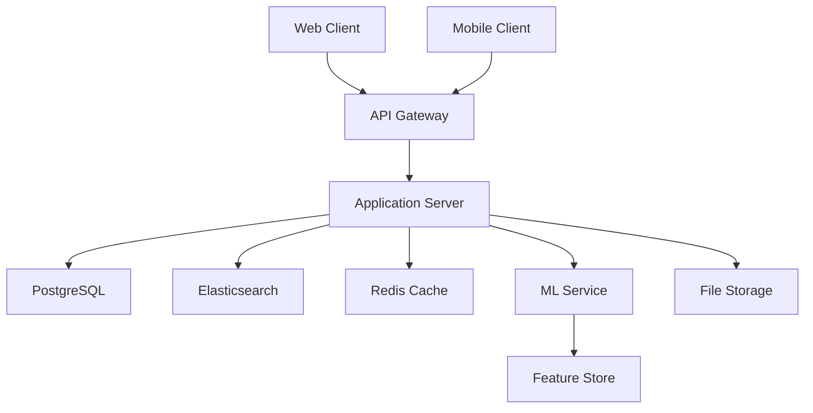

# The Herbivore Project - Technical Design Document

## Table of Contents
1. [Overview](#1-overview)
2. [Features](#2-features)
3. [Technology Stack](#3-technology-stack)
4. [Architecture](#4-architecture)
5. [Database Schema](#5-database-schema)
6. [API Design](#6-api-design)
7. [Machine Learning Model](#7-machine-learning-model)
8. [UI/UX Design](#8-uiux-design)
9. [Security and Compliance](#9-security-and-compliance)
10. [Development Roadmap](#10-development-roadmap)

## 1. Overview

### Project Description
The Herbivore Project is a comprehensive web and mobile application designed to catalog and provide detailed information about cannabis strains. The platform aims to create an educational and community-driven ecosystem for cannabis enthusiasts and researchers.

### Target Audience
- Cannabis consumers seeking strain information
- Medical cannabis patients
- Researchers and industry professionals
- Dispensary owners and staff

### Core Objectives
- Build a comprehensive, accurate strain database
- Create an engaged, knowledgeable community
- Provide personalized strain recommendations
- Educate users about cannabis safety and effects
- Ensure compliance with regional regulations

## 2. Features

### A. Cannabis Strain Database
#### Core Data Points
- Strain name and unique identifier
- Type classification (Indica, Sativa, Hybrid with percentages)
- Cannabinoid profile (THC, CBD, CBN, etc.)
- Terpene profile
- Genetic lineage
- Growing characteristics
- Price range indicators

#### Additional Metadata
- Associated medical conditions
- Common effects
- Flavor profiles
- Aroma characteristics
- Growing difficulty
- Average user rating

### B. Search and Discovery System
#### Search Capabilities
- Full-text search with typo tolerance
- Autocomplete suggestions
- Natural language processing for effect-based queries
- Voice search support

#### Filtering Options
- Cannabinoid content ranges
- Effect categories
- Medical conditions
- Flavor profiles
- Price ranges
- User ratings
- Growing difficulty

### C. User Review System
#### Review Components
- Numerical rating (1-5 stars)
- Effect reporting
- Consumption method
- Dosage information
- Pros and cons
- Photo uploads
- Experience description
- Helpfulness voting

#### Review Management
- Moderation system
- Report functionality
- Quality scoring algorithm
- User reputation system

### D. Dispensary Integration
#### Location Features
- Geolocation-based search
- Google Maps integration
- Operating hours and contact info
- Real-time inventory (where available)
- Price comparison
- User reviews and ratings

#### Dispensary Portal
- Inventory management
- Strain information updates
- Customer feedback management
- Analytics dashboard

### E. Recommendation Engine
#### Personalization System
- Collaborative filtering algorithm
- Content-based recommendations
- Hybrid approach combining multiple signals
- A/B testing framework

#### Data Collection
- User preferences questionnaire
- Usage patterns
- Review history
- Medical conditions (optional)
- Effect preferences
- Flavor preferences

### F. User Account System
#### Core Functionality
- Secure authentication
- Profile management
- Strain favorites/bookmarks
- Review management
- Personalized recommendations
- Usage journal

#### Social Features
- Follow other users
- Share strains/reviews
- Community discussions
- Direct messaging
- Activity feed

### G. Educational Resources
#### Content Types
- Strain guides
- Consumption methods
- Safety information
- Legal resources
- Medical research
- Growing guides

#### Educational Features
- Interactive learning modules
- Video content
- Infographics
- Expert articles
- Community contributions
- FAQ system

## 3. Technology Stack

### Frontend
- **Framework**: React 18
- **State Management**: Redux Toolkit
- **UI Components**: Tailwind CSS + shadcn/ui
- **Data Visualization**: Recharts
- **Maps Integration**: Google Maps API
- **Testing**: Jest + React Testing Library

### Backend
- **Runtime**: Node.js
- **Framework**: Express.js
- **API Documentation**: OpenAPI/Swagger
- **Authentication**: JWT + OAuth2
- **Rate Limiting**: Express-rate-limit

### Database
- **Primary Database**: PostgreSQL
- **Search Engine**: Elasticsearch
- **Caching Layer**: Redis
- **File Storage**: AWS S3

### Machine Learning
- **Framework**: Python + scikit-learn
- **Model Serving**: Flask API
- **Feature Store**: Feast
- **Model Monitoring**: MLflow

### DevOps
- **CI/CD**: GitHub Actions
- **Hosting**: AWS (ECS + RDS)
- **Monitoring**: Datadog
- **Logging**: ELK Stack

## 4. Architecture

### System Components


### High-Level Flow
1. Client requests handled through API Gateway
2. Authentication/Authorization via JWT
3. Application logic in Express server
4. Data persistence in PostgreSQL
5. Search queries to Elasticsearch
6. Caching layer with Redis
7. ML predictions via separate service
8. File storage in S3

## 5. Database Schema

### Strains
```sql
CREATE TABLE strains (
    id UUID PRIMARY KEY,
    name VARCHAR(255) NOT NULL,
    type ENUM('Indica', 'Sativa', 'Hybrid') NOT NULL,
    thc_content DECIMAL(4,2),
    cbd_content DECIMAL(4,2),
    effects JSONB,
    flavors JSONB,
    medical_uses JSONB,
    genetic_lineage JSONB,
    created_at TIMESTAMP DEFAULT CURRENT_TIMESTAMP,
    updated_at TIMESTAMP DEFAULT CURRENT_TIMESTAMP
);
```

### Users
```sql
CREATE TABLE users (
    id UUID PRIMARY KEY,
    username VARCHAR(50) UNIQUE NOT NULL,
    email VARCHAR(255) UNIQUE NOT NULL,
    password_hash VARCHAR(255) NOT NULL,
    preferences JSONB,
    created_at TIMESTAMP DEFAULT CURRENT_TIMESTAMP,
    updated_at TIMESTAMP DEFAULT CURRENT_TIMESTAMP
);
```

### Reviews
```sql
CREATE TABLE reviews (
    id UUID PRIMARY KEY,
    user_id UUID REFERENCES users(id),
    strain_id UUID REFERENCES strains(id),
    rating INTEGER CHECK (rating BETWEEN 1 AND 5),
    effects JSONB,
    content TEXT,
    helpful_votes INTEGER DEFAULT 0,
    created_at TIMESTAMP DEFAULT CURRENT_TIMESTAMP,
    UNIQUE(user_id, strain_id)
);
```

### Usage Logs
```sql
CREATE TABLE usage_logs (
    id UUID PRIMARY KEY,
    user_id UUID REFERENCES users(id),
    strain_id UUID REFERENCES strains(id),
    dosage DECIMAL(5,2),
    method VARCHAR(50),
    effects JSONB,
    timestamp TIMESTAMP DEFAULT CURRENT_TIMESTAMP
);
```

## 6. API Design

### RESTful Endpoints

#### Strain Management
```
GET    /api/v1/strains
GET    /api/v1/strains/{id}
POST   /api/v1/strains
PUT    /api/v1/strains/{id}
DELETE /api/v1/strains/{id}
```

#### User Management
```
POST   /api/v1/auth/register
POST   /api/v1/auth/login
GET    /api/v1/users/{id}
PUT    /api/v1/users/{id}
DELETE /api/v1/users/{id}
```

#### Review Management
```
GET    /api/v1/strains/{id}/reviews
POST   /api/v1/strains/{id}/reviews
PUT    /api/v1/reviews/{id}
DELETE /api/v1/reviews/{id}
```

#### Recommendation Engine
```
GET    /api/v1/recommendations
POST   /api/v1/recommendations/feedback
```

### API Response Format
```json
{
    "status": "success",
    "data": {},
    "message": "",
    "metadata": {
        "timestamp": "",
        "version": ""
    }
}
```

## 7. Machine Learning Model

### Recommendation Engine Architecture

#### Data Pipeline
1. Feature Engineering
   - User preferences
   - Strain characteristics
   - Usage patterns
   - Review sentiment
   - Effect correlations

2. Model Training
   - Collaborative filtering
   - Content-based filtering
   - Hybrid approach
   - Regular retraining schedule

3. Serving Infrastructure
   - Real-time predictions
   - Batch predictions
   - A/B testing framework
   - Model monitoring

### Algorithm Details
```python
class StrainRecommender:
    def __init__(self):
        self.collaborative_model = CollaborativeFilter()
        self.content_model = ContentBasedFilter()
        
    def get_recommendations(self, user_id):
        collaborative_recs = self.collaborative_model.predict(user_id)
        content_recs = self.content_model.predict(user_id)
        return self.ensemble_predictions(collaborative_recs, content_recs)
```

## 8. UI/UX Design

### Design System
- Typography: Inter for headers, System UI for body
- Color Palette: 
  - Primary: #4F46E5
  - Secondary: #10B981
  - Accent: #F59E0B
  - Neutrals: #111827 to #F9FAFB
- Components: shadcn/ui library
- Spacing System: 4px base unit
- Responsive Breakpoints: 640px, 768px, 1024px, 1280px

### Key Screens
1. Home/Discovery
2. Strain Details
3. User Profile
4. Review Creation
5. Educational Content
6. Search Results
7. Recommendations

### Navigation Structure
```
Home
├── Discover
├── Search
├── Strains
│   ├── Details
│   └── Reviews
├── Profile
│   ├── Favorites
│   ├── Reviews
│   └── Settings
└── Education
    ├── Guides
    ├── Safety
    └── Research
```

## 9. Security and Compliance

### Data Protection
- End-to-end encryption
- Regular security audits
- Penetration testing
- Data backup strategy
- GDPR compliance
- CCPA compliance

### Authentication & Authorization
- JWT-based authentication
- Role-based access control
- OAuth2 social login
- 2FA support
- Session management
- Password policies

### Privacy Considerations
- Data minimization
- User consent management
- Privacy policy
- Terms of service
- Age verification
- Geographic restrictions

## 10. Development Roadmap

### Phase 1: MVP (3 months)
- Basic strain database
- User authentication
- Simple search/filter
- Basic reviews
- Mobile-responsive design

### Phase 2: Enhanced Features (3 months)
- Advanced search
- Recommendation engine
- Dispensary integration
- Educational content
- Social features

### Phase 3: Scale & Optimize (3 months)
- Performance optimization
- Analytics implementation
- Advanced personalization
- Mobile apps
- API marketplace

### Phase 4: Enterprise & Integration (3 months)
- Enterprise features
- Third-party integrations
- Advanced analytics
- International expansion
- Premium features
